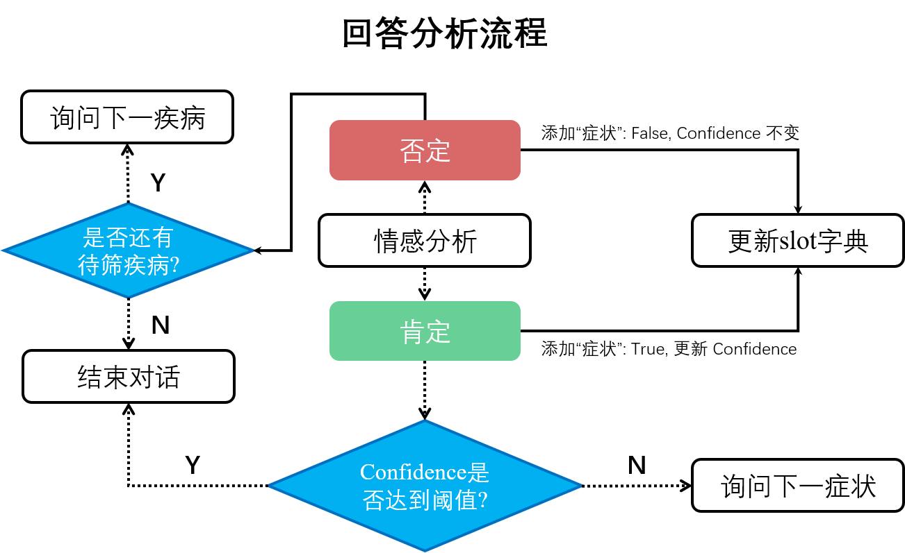

### 基于症状的五类疾病的多轮问诊

#### 1.五类疾病及症状简介

> 慢性阻塞性肺疾病、间质性肺病、胸腔积液、气胸、肺动脉高压，5类疾病合计共23种症状。
>
> - 5类疾病共有：咳嗽、呼吸困难、气促。
> - 4类疾病共有：胸痛。
> - 3类疾病共有：发烧、呼吸痛、哮喘。
> - 2类疾病共有：背痛、鼻塞、鼻炎、喉咙痛、咳痰、肋骨痛。
> - 1类疾病独有：**间质性肺病**——耳朵痛、头痛。**慢性阻塞性肺疾病**——胸部充血、胸闷。**胸腔积液**——腹痛。**气胸**——肩痛。**肺动脉高压**——心悸、咯血、水肿、窒息。

#### 2.多轮问诊基本流程


各模块介绍：

- 病人自述症状

  > 要求自述3个或以上症状，方便接下来的初筛。如：“我有点咳嗽，并且有点发烧和气促。”

- 症状实体识别

  > 暂时沿用药物知识图谱问答中的实体模型来识别症状。初步实验发现上述23种症状都能被模型捕捉到，后续的后处理流程还有待设计（主要是归一化，比如把识别到的干咳归一化到咳嗽）。例如，在上述病人输入的自然语言语句中，模型可以识别到“咳嗽”、“发烧”、 “气促”。

- 初筛病种

  > 根据病人自述的症状，初步筛选出5种病中所有可能的疾病，必须满足自述症状是疾病症状的子集。例如，根据“咳嗽”、“发烧”、“气促”初步筛选出慢性阻塞性肺疾病、间质性肺病、胸腔积液三种疾病。

- 初始化

  > 初步筛选出可能的疾病后，为每个疾病初始化并维护一个slot字典。字典中，除了已知症状key以外，还有一个Confidence key，用以确定是否已经达到可以确诊的置信度。置信度目前设置为对应疾病总症状数量的一半。举个例子，下面是慢性阻塞性肺疾病的症状表及出现概率：
  >
  > 于是慢性阻塞性肺疾病的slot字典就初始化为：
  > 
  > ```python
  > {
  >  '咳嗽': True, 
  >  '气促': True, 
  >  '发烧': True, 
  >  'Confidence': 3
  > }
  > ```
  
- 询问症状

  > 为了减轻确诊工作量，询问的症状优先从每种疾病独特的症状问起，优先从当前置信度距阈值接近的疾病问起。例如，上述三种疾病的阈值分别为6，5，5，而对应当前置信度为3，故可先从间质性肺病中的任一个独特症状问起，譬如“请问您是否感到头痛？”

- 回答

  > 用户的自然语言回答。

- 回答分析

  > 具体请看流程图。
  >
  > 

- 最终结果

  > 收到结束对话请求后，输出最终结果，要么是诊断，要么是“不清楚”。

