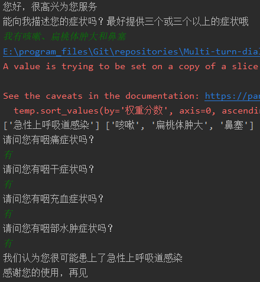

### 基于症状疾病的多轮问诊

#### 1.疾病及症状简介

> - 目前系统中共150种疾病，843种症状，每种疾病对应的平均症状数量为20.34个。
> - 疾病涵盖多个专科，每种疾病的每种症状都有相应的权重，权重共三档：1、15、20。

#### 2.多轮问诊基本流程

各模块介绍：

- 病人自述症状

  > 要求自述3个或以上症状，方便接下来的初筛。如：“我有点咳嗽，并且有点发烧和气促。”

- 症状实体识别

  > 利用开源工具RASA的NLU(Natural Language Understanding)模块和上述843种症状，训练出了一个简易的命名实体识别模型，训练共用时12小时。例如，在上述病人输入的自然语言语句中，模型可以识别到“咳嗽”、“发烧”、 “气促”。

- 初筛病种

  > 根据病人自述的症状，初步筛选出所有可能的疾病，必须满足自述症状是疾病症状的子集。

- 初始化

  > 初步筛选出可能的疾病后，将疾病和已知症状分别存入一个列表中。在后续的问答过程中，疾病列表元素用于触发确认器，症状列表会不断补充。
  
- 询问症状
  
> 为了减轻确诊工作量，询问的症状优先从每种疾病权重高的症状问起。

- 回答

  > 用户的自然语言回答。

- 确认条件
  
  > 每个疾病对应于多个症状，若在问答过程中病人确定的症状权重之和达到该病总权重之和的一半则返回确诊信息，并结束问答；否则对话一直到遍历完所有的可能疾病为止。
  
- 回答分析

  > 具体请看流程图。
  >
  > 

- 最终结果

  > 收到结束对话请求后，输出最终结果，确认疾病时返回具体疾病诊断，否则返回“无法确认”。

#### 3.各主要文件介绍

- main.py

  > 多轮问答的入口，加载好模型后输入自然语言句子即可激活。

- utils_main/classifier.py 

  > 处理症状列表，查出可能的疾病。

- utils_main/dispatcher.py 

  > 管理筛选出的疾病，将可能的疾病依次送入确认器中。

- utils_main/validator.py 

  > 确认器，根据此轮疾病以及已经确认的症状发问，直到确诊或排除当前疾病。

- disease-symptom.csv 

  > 疾病-症状-权重表。

- id_symptom.csv

  > id和症状的对应表，这是由于RASA的实体识别模型返回的是实体id。

- utils_main/symptom.txt

  > 一个字典，内容为各种症状对应的所有疾病，用于快速筛选出疾病。

#### 4.依赖

最新版RASA。

#### 5.目前效果展示

