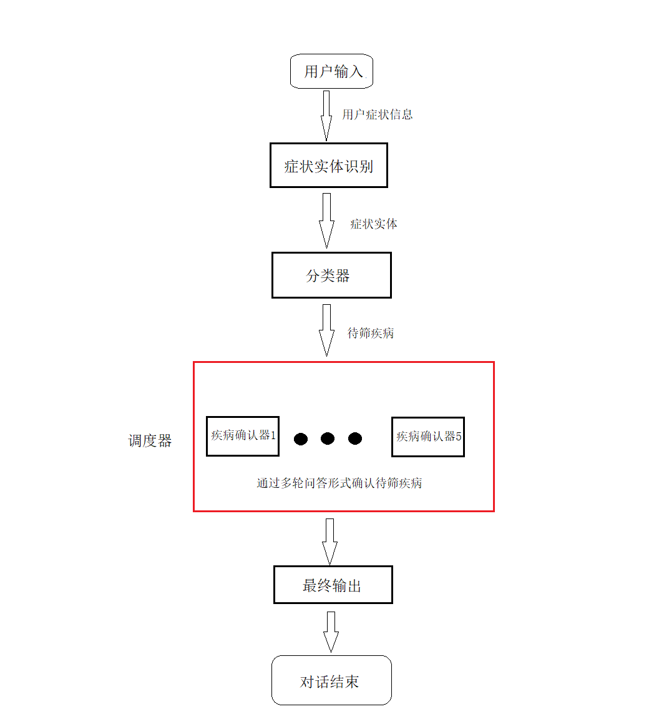

### 开发基本流程

#### 1. 意图识别/实体识别模块
> 该模块通过NLU技术，根据用户的输入，识别出具体的症状实体，成为下一流程的输入接口。

#### 2. 分类器模块
> 根据1中症状实体，分类器将根据症状实体确认待筛疾病，成为下一流程的输入接口。

#### 3. 调度器模块
> 调度器接收分类器给出的疾病，按先后顺序执行具体的疾病确认器。当某一疾病确认器确认时，对话结束。否则执行下一确认器，若所有确认器执行完成且均没有确认。则输出“无法确认”并结束对话。

#### 4. 疾病确认器模块
> 5个疾病分别拥有各自的疾病确认器，疾病确认器用来维护该疾病的slot字典。通过多轮问答形式，填充slot字典，从而确认是否满足该疾病。
> 如满足疾病确认条件，则输入结果，并结束对话。否则返回调度器。

#### 5. 总体流程
总体流程结构图如下：
<<<<<<< HEAD

=======

>>>>>>> 478f7449acd9a1cddda6e4431aed1d491b99470b
